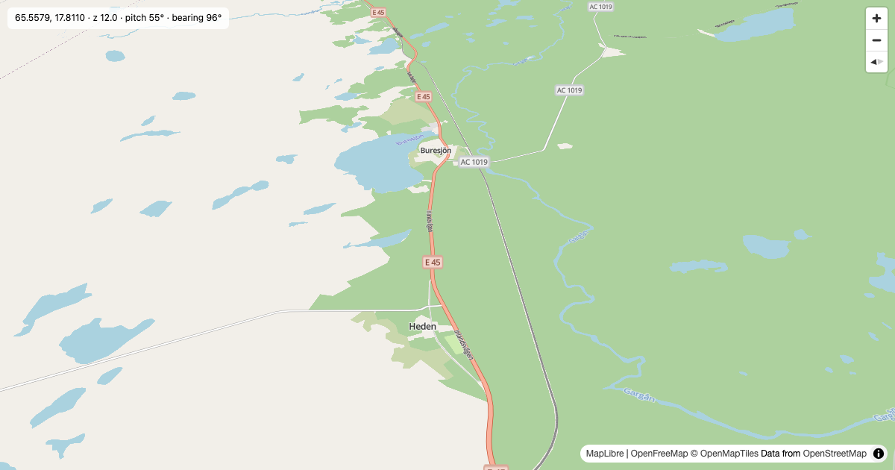

# Basemap

> A self-hosted MapLibre GL style: the OpenMapTiles "OSM" vector style (v3.16) repointed at OpenFreeMap's worldwide vector tiles, with all fonts, sprites and icons served from GitHub Pages.

> [!NOTE] > **Canonical host is www.ogis.org** — never use the org's legacy `*.github.io` Pages host. It 301-redirects to www.ogis.org, and the redirect hop breaks CORS in browsers, so every published URL points at www.ogis.org directly.

## Screenshot



> [!NOTE]
> Regenerated on every build — each `./scripts/build.sh` run renders a fresh random map (a random land point anywhere on Earth, quality-gated). Run `npm run screenshot:random` any time for a new one without the full build.

## Overview

Basemap vendors the OpenMapTiles "OSM" vector style (v3.16 — the vector equivalent of the official openstreetmap-carto raster) and repoints it at OpenFreeMap's worldwide, free OpenMapTiles-schema vector tiles. All fonts, sprites and icons are self-hosted on GitHub Pages with open CORS, so anyone can use the style or its assets directly.

The style is built from vendored upstream sources with the same docker tooling OpenMapTiles uses (`openmaptiles-tools:7.2`), then rewritten to point at the published URLs. See [docs/2.build.md](docs/2.build.md) for the pipeline.

## Live URLs

| Asset  | URL                                                        |
| ------ | ---------------------------------------------------------- |
| Demo   | https://www.ogis.org/basemap/                              |
| Style  | https://www.ogis.org/basemap/style.json                    |
| Glyphs | https://www.ogis.org/basemap/fonts/{fontstack}/{range}.pbf |
| Sprite | https://www.ogis.org/basemap/sprite                        |
| Icons  | https://www.ogis.org/basemap/icons/{name}.svg              |
| Tiles  | https://tiles.openfreemap.org/planet                       |

## Usage

### MapLibre GL JS

```js
const map = new maplibregl.Map({
  container: "map",
  style: "https://www.ogis.org/basemap/style.json",
});
```

### Assets in a custom style

```json
{
  "version": 8,
  "sources": {
    "openmaptiles": {
      "type": "vector",
      "url": "https://tiles.openfreemap.org/planet"
    }
  },
  "glyphs": "https://www.ogis.org/basemap/fonts/{fontstack}/{range}.pbf",
  "sprite": "https://www.ogis.org/basemap/sprite"
}
```

### Remixing

Edit the vendored layer styles under `vendor/openmaptiles/layers/*/style.json`, then rebuild:

```bash
./scripts/build.sh
```

See [docs/3.remixing.md](docs/3.remixing.md) for details.

### Screenshots

Render the demo harness to a PNG with Playwright:

```bash
npm run screenshot -- --lat 51.5074 --lng -0.1278 --zoom 12 --pitch 45 --rotation 20 --width 1200 --height 630 --out london.png
```

`npm run screenshot:random` renders a random land point anywhere on Earth (quality-gated) to `screenshot.png`. Full flag reference and the harness URL API: [docs/4.screenshots.md](docs/4.screenshots.md).

## Attribution and Licences

Attribution is baked into the published style: **OpenFreeMap · © OpenMapTiles · Data from OpenStreetMap**. Keep it when remixing.

| Project                                                                    | Component                 | Licence      |
| -------------------------------------------------------------------------- | ------------------------- | ------------ |
| [OpenStreetMap](https://www.openstreetmap.org)                             | Tile data                 | ODbL-1.0     |
| [OpenFreeMap](https://openfreemap.org)                                     | Tile service              | MIT          |
| [OpenMapTiles](https://openmaptiles.org)                                   | Style code                | BSD-3-Clause |
| [OpenMapTiles](https://openmaptiles.org)                                   | Design and cartography    | CC-BY-4.0    |
| [openstreetmap-carto](https://github.com/gravitystorm/openstreetmap-carto) | Design & icon inspiration | CC0-1.0      |
| [Open Sans](https://fonts.google.com/specimen/Open+Sans)                   | Font                      | Apache-2.0   |
| [Noto Sans](https://fonts.google.com/noto/specimen/Noto+Sans)              | Font                      | OFL-1.1      |
| [MapLibre GL JS](https://maplibre.org)                                     | Demo renderer             | BSD-3-Clause |

## Further Reading

- [Getting started](docs/1.start.md)
- [Build pipeline](docs/2.build.md)
- [Remixing the style](docs/3.remixing.md)
- [Screenshot pipeline](docs/4.screenshots.md)
- [Full docs index](docs/README.md)
